# 🚀 LearnCode Website

<div align="center">


**A modern, full-stack learning platform for online courses**

[](https://reactjs.org/)
[](https://nodejs.org/)
[](https://mongodb.com/)
[](https://tailwindcss.com/)

</div>

---

## ✨ Features

<table>
<tr>
<td width="50%">

### 🎓 **For Students**
- 📝 User registration & profile management
- 🔍 Browse comprehensive course catalog
- 📊 Track learning progress
- ⭐ Rate & review courses
- 🛒 Shopping cart functionality
- 📧 Email notifications

</td>
<td width="50%">

### 👨‍🏫 **For Instructors**
- 📚 Create & manage courses
- 🎥 Upload video content
- 📑 Organize course sections
- 💰 Payment integration
- 📈 Dashboard analytics
- 👥 Student management

</td>
</tr>
</table>

## 🏗️ Project Architecture

```mermaid
graph TB
    A[👤 User Interface] --> B[⚛️ React Frontend]
    B --> C[🌐 Express API]
    C --> D[🍃 MongoDB Database]
    C --> E[💳 Payment Gateway]
    C --> F[☁️ Cloudinary Storage]
    C --> G[📧 Email Service]
```

<div align="center">



</div>

### 📁 High-Level Structure

```
🏠 LearnCode-Website/
├── 🎨 frontend/learning-platfrom/     # React application
│   ├── 📦 src/
│   │   ├── 🧩 components/           # Reusable UI components
│   │   ├── 📄 pages/               # Application pages
│   │   ├── 🎛️ Dashboard/           # Admin & instructor panels
│   │   ├── 🛍️ catalogs/            # Course catalog features
│   │   └── 🔧 utils/               # Helper functions
│   └── 🏗️ build/                   # Production build
└── 🖥️ server/                       # Node.js backend
    ├── 🎯 controllers/              # Business logic
    ├── 📊 models/                   # Database schemas
    ├── 🛣️ router/                   # API endpoints
    ├── ⚙️ config/                   # App configuration
    └── 🔧 utils/                    # Server utilities
```

## 🚀 Quick Start

### 📋 Prerequisites

<div align="center">

| Tool | Version | Purpose |
|------|---------|---------|
| 📦 Node.js | v16+ | Runtime environment |
| 🐙 Git | Latest | Version control |
| 🍃 MongoDB | 4.4+ | Database |

</div>

### ⚡ Installation

<details>
<summary>📥 <strong>1. Clone Repository</strong></summary>

```powershell
git clone https://github.com/azad52786/LearnCode-website.git
cd LearnCode-website
```

</details>

<details>
<summary>📦 <strong>2. Install Dependencies</strong></summary>

```powershell
# Install frontend dependencies
cd frontend/learning-platfrom
npm install

# Install backend dependencies
cd ../../server
npm install
```

</details>

<details>
<summary>⚙️ <strong>3. Environment Setup</strong></summary>

Create `.env` file in `server/` directory:

```env
# Database
MONGODB_URI=your_mongodb_connection_string

# JWT
JWT_SECRET=your_jwt_secret

# Payment Gateways
RAZORPAY_KEY_ID=your_razorpay_key
RAZORPAY_SECRET=your_razorpay_secret
CASHFREE_APP_ID=your_cashfree_app_id
CASHFREE_SECRET_KEY=your_cashfree_secret

# Cloudinary
CLOUDINARY_CLOUD_NAME=your_cloud_name
CLOUDINARY_API_KEY=your_api_key
CLOUDINARY_API_SECRET=your_api_secret

# Email
MAIL_HOST=smtp.gmail.com
MAIL_USER=your_email@gmail.com
MAIL_PASS=your_app_password
```

</details>

<details>
<summary>🏃‍♂️ <strong>4. Run Development Servers</strong></summary>

```powershell
# Start backend server (Terminal 1)
cd server
npm run dev

# Start frontend server (Terminal 2)
cd frontend/learning-platfrom
npm start
```

**🌐 Access URLs:**
- Frontend: http://localhost:3000
- Backend API: http://localhost:5000

</details>

## 🛠️ Tech Stack

<div align="center">

### Frontend


### Backend


### Payment & Services


</div>

---

## 📚 Key Components

<table>
<tr>
<td width="33%">

### 🎨 **Frontend**
- **React 18** - Modern UI framework
- **TailwindCSS** - Utility-first styling
- **Redux Toolkit** - State management
- **React Router** - Navigation
- **Axios** - HTTP client
- **React Hook Form** - Form handling

</td>
<td width="33%">

### ⚙️ **Backend**
- **Express.js** - Web framework
- **MongoDB** - NoSQL database
- **Mongoose** - ODM for MongoDB
- **JWT** - Authentication
- **Bcrypt** - Password hashing
- **Multer** - File uploads

</td>
<td width="33%">

### 🔌 **Integrations**
- **Razorpay/CashFree** - Payments
- **Cloudinary** - Media storage
- **Nodemailer** - Email service
- **OTP Generator** - Verification
- **CORS** - Cross-origin requests

</td>
</tr>
</table>

## 🤝 Contributing

We welcome contributions! Here's how you can help:

<div align="center">

[](https://github.com/azad52786/LearnCode-website/issues)

</div>

### 🔄 Process

1. **🍴 Fork** the repository
2. **🌿 Create** your feature branch
   ```bash
   git checkout -b feature/amazing-feature
   ```
3. **💻 Commit** your changes
   ```bash
   git commit -m 'Add amazing feature'
   ```
4. **🚀 Push** to the branch
   ```bash
   git push origin feature/amazing-feature
   ```
5. **📝 Open** a Pull Request

### 🐛 Found a Bug?

- Open an [issue](https://github.com/azad52786/LearnCode-website/issues)
- Describe the bug and steps to reproduce
- Include screenshots if applicable

---

## 📄 License

<div align="center">


This project is licensed under the **MIT License** - see the [LICENSE](LICENSE) file for details.

</div>

---

## 📞 Contact & Support

<div align="center">

### 👨‍💻 Developer

[](https://github.com/azad52786)
[](mailto:azad52786@example.com)

### 🆘 Need Help?

- 📖 [Documentation](https://github.com/azad52786/LearnCode-website/wiki)
- 🐛 [Report Issues](https://github.com/azad52786/LearnCode-website/issues)
- 💬 [Discussions](https://github.com/azad52786/LearnCode-website/discussions)

</div>

---

<div align="center">

### ⭐ Star this repo if you find it helpful!

[](https://github.com/azad52786/LearnCode-website/stargazers)
[](https://github.com/azad52786/LearnCode-website/network/members)

**Made with ❤️ for the learning community**

</div>
